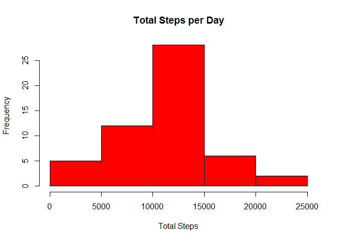
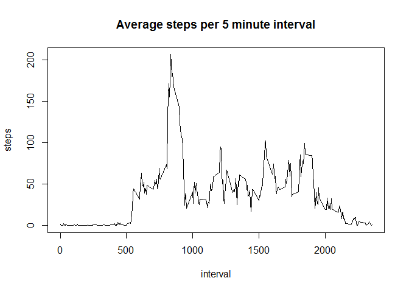
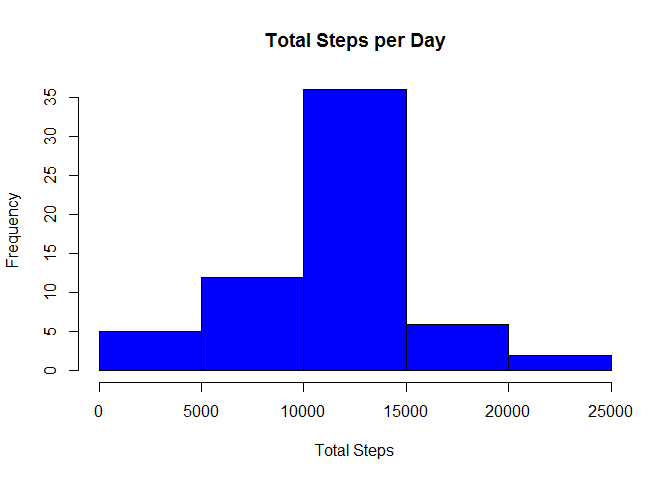
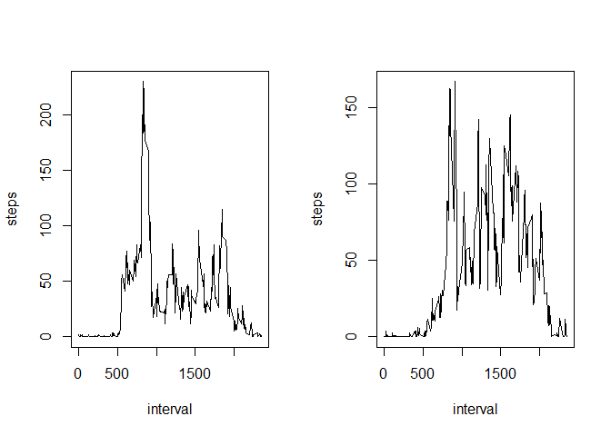

# Reproducible Research: Peer Assessment 1


## Loading and preprocessing the data

Note we are assuming the dataset is located in the current working
directory. As the dataset is clean, no transformations are needed at
this time.


```r
activity <- read.csv('activity.csv')
```


## What is mean total number of steps taken per day?

A new dataset 'dayTotals' is created by aggregating the total steps
per day:


```r
dayTotals <- aggregate(steps ~ date, data=activity, FUN="sum")
```

This allows the plotting of a histogram of total steps per day:


```r
hist(dayTotals$steps, main="Total Steps per Day",
     xlab="Total Steps", col="red")
```

 

The mean total steps per day can the be calculated:


```r
mean(dayTotals$steps)
```

```
## [1] 10766.19
```

As can the median total steps per day:


```r
median(dayTotals$steps)
```

```
## [1] 10765
```

## What is the average daily activity pattern?

A new dataset 'intervalMeans' is created by aggregating the average
(mean) steps for each interval:


```r
intervalMeans <- aggregate(steps ~ interval, data=activity, FUN="mean")
```

Which allows the plotting of a timeseries of average steps taken
in each 5 minute intercal:


```r
with(intervalMeans, plot(x=interval, y=steps, type='l',
                        main='Average steps per 5 minute interval'))
```

 

## Imputing missing values

A quick calculation shows 2304 missing (NA) values:


```r
sum(is.na(activity$steps))
```

```
## [1] 2304
```

The timeseries plot shown above suggests a lot of variation in activity level for each time interval. This does make intuitive sense, as it seems
likely that someone would have similar activity levels at a given
time each day. For this reason, it seems like the best imputation
strategy would be to replace each missing value with the average value
of that interval across the other days.

The easiest way is to use the intervalMeans data calculated before,
first merging it with the main dataset, creating a column
called 'steps.mean' which is the mean across days for a given interval:


```r
newActivity <- merge(activity, intervalMeans, by='interval',
                    suffixes=c('', '.mean'), sort=FALSE)
```

And then select the rows where 'steps' is missing (NA) and replacing with the value for 'steps.mean':


```r
newActivity[is.na(newActivity$steps), 'steps'] <- 
                newActivity[is.na(newActivity$steps), 'steps.mean']
```

And now the 'steps.mean' column can be removed, and the number of missing values checked again to ensure it is now zero. The data is also sorted by date then interval:


```r
newActivity$steps.mean <- NULL
newActivity <- newActivity[with(newActivity, order(date, interval)), ]
sum(is.na(newActivity$steps))
```

```
## [1] 0
```


Now that there are no missing values, a new set of day totals can be calculated as before:


```r
newDayTotals <- aggregate(steps ~ date, data=newActivity, FUN="sum")
```

And a histogram of the total steps per day, including imputed values:


```r
hist(newDayTotals$steps, main="Total Steps per Day",
     xlab="Total Steps", col="blue")
```

 

The mean total steps per day can then be calculated:


```r
mean(newDayTotals$steps)
```

```
## [1] 10766.19
```

As can the median total steps per day:


```r
median(newDayTotals$steps)
```

```
## [1] 10766.19
```

Note that the mean is still 10766.19, however the median is slightly higher than before, at 10766.19 vs 10765 in the dataset without imputation. Given the tiny difference, it would be fair to say that imputing missing data has not had a material effect on the estimates of total daily steps.

## Are there differences in activity patterns between weekdays and weekends?


```r
day <- weekdays(as.POSIXct(newActivity$date, format="%Y-%m-%d"))
newActivity$weekday <- 'weekday'
newActivity$weekday[day == 'Saturday' | day == 'Sunday'] <- 'weekend'
newActivity$weekday <- as.factor(newActivity$weekday)

newIntervalMeans <- aggregate(steps ~ interval + weekday,
                              data=newActivity, FUN="mean")


par(mfrow = c(1, 2), main="Average Steps per Interval")
```

```
## Warning in par(mfrow = c(1, 2), main = "Average Steps per Interval"):
## "main" is not a graphical parameter
```

```r
with(newIntervalMeans[newIntervalMeans$weekday=='weekday', ],
     plot(x=interval, y=steps, type='l'))

with(newIntervalMeans[newIntervalMeans$weekday=='weekend', ],
     plot(x=interval, y=steps, type='l'))
```

 
